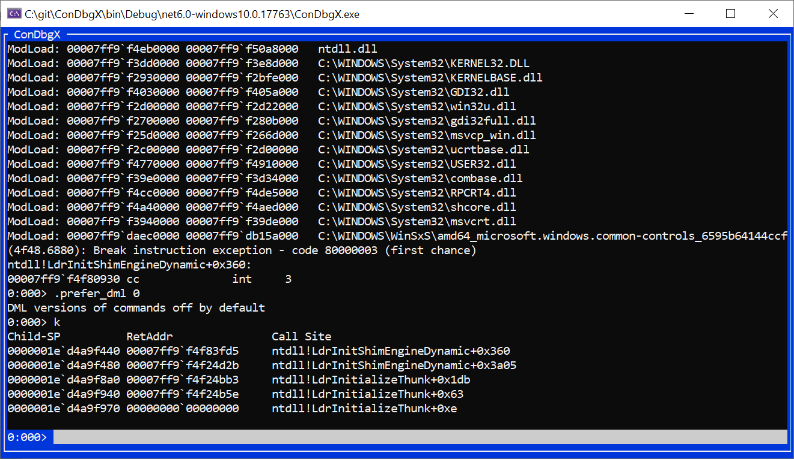

# ConDbgX - A DbgEng-based debugger using Terminal.Gui

A demonstration of using the [DbgX](https://www.nuget.org/packages/Microsoft.Debugging.Platform.DbgX) nuget package, with a console UI powered by [Terminal.Gui](https://github.com/gui-cs/Terminal.Gui)



Using VS2022, you should be able to build and run ConDbgX.csproj directly. The app interprets the command line argument as a usermode app to debug, so running ```ConDbgX.exe cmd.exe``` will start a debugging session for cmd.exe.

## How does it work?

The main functinoality is in CommandView.cs and CommandViewModel.cs. The ```CommandViewModel``` is the only class that talks to DbgX through the ```DebugEngine``` class. It talks to the view through data binding (using ReactiveUI) and some other events/methods. I don't really know what I'm doing with ReactiveUI, so I'm sure there are better ways to connect things together. It is important to have a functioning ```SynchronizationContext``` though, and ReactiveUI has one that works well here it seems.

### Why is there a copy of TextView from Terminal.Gui?

I copied TextView and the supporting classes from the Terminal.Gui repo. The main reason was so that I could add some methods to have a better way of appending text without having to reset/reparse the entire text output every time new output is appended. I also thought it might be needed to have colored text/clickable links, but I didn't get around to adding that. There are a few other changes made to the TextView, like starting to rip out support for text wrapping (to make it easier to support clickable links).

## What's working?

* Basic commands work fine, including step/go.
* Tab completion also works on the command line.
* Scrolling in the output window also works well.

## What's not working?

Pretty much everything. Notably:

* No DML support, so no links or colors. Some commands that produce DML even if ".prefer_dml" is disabled, and ConDbgX makes no attempt to filter this out. It would be possible to support colored text via the ```TextView``` (or some subclass) which can set different colors per ```Rune```.
* No support for breaking into the debugger. This would require setting up a keybinding that sends the SetInterruptRequest.
* No support for any standard debugging extension or symsrv. The DbgX package comes with only dbgeng.dll, dbgcore.dll, dbghelp.dll, dbgmodel.dll, and srcsrv.dll.
  * To add support for symbol servers like msdl.microsoft.com through symsrv.dll, adding a reference to [Microsoft.Debugging.Platform.SymSrv](https://www.nuget.org/packages/Microsoft.Debugging.Platform.SymSrv) would be needed.
  * To take advantage of the standard debugging extensions, you would probably need to change the version of dbgeng that gets loaded to be from a Windows SDK install. I think that should be possible, but I haven't tried it.
* No support for anything besides live usermode debugging. Adding support for dump debugging or kernel debugging would not be hard but would require adding command line processing.

## Want to contribute?

I'm happy to take any and all contributions. I don't have specific plans for improvements on this, but I'm happy to answer any questions and help guide anyone that wants to contribute. Feel free to reach out to me on [Twitter](https://twitter.com/timmisiak)